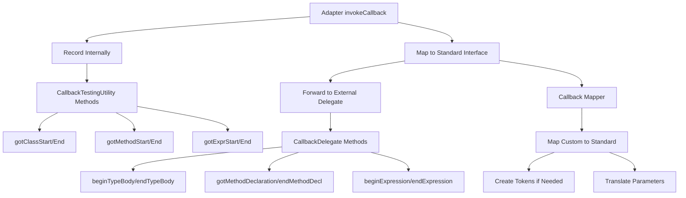

# Universal Callback Delegation Fix - Design Document

## Executive Summary

This document outlines a universal solution to fix the callback delegation issue affecting 43 failing tests across 6 test classes in the `integration.e2e` package. The core issue is that adapters record callbacks internally but fail to forward them to the test infrastructure's callback delegate.

## Current Architecture Problem

### The Disconnect
```
Adapter (extends CallbackTestingUtility)
    ↓
    Records callbacks internally via:
    - gotClassStart()
    - gotMethodStart() 
    - gotExprStart()
    etc.
    ↓
    ❌ BROKEN: Does NOT forward to externalDelegate
    ↓
Test Infrastructure (expects callbacks in document.getCallbackDelegate())
    ↓
    Checks empty delegate → TEST FAILS
```

## Proposed Solution Architecture

### Callback Flow Design


## Universal Callback Forwarding Mechanism

### 1. Core Forwarding Pattern

```java
public abstract class BaseCallbackForwardingAdapter extends CallbackTestingUtility {
    protected CallbackDelegate externalDelegate;
    
    protected void forwardCallback(String callbackType, int lineNumber, Object... params) {
        // Record internally for adapter use
        recordInternalCallback(callbackType, lineNumber, params);
        
        // Forward to external delegate if present
        if (externalDelegate != null) {
            CallbackDelegateForwarder.forward(externalDelegate, callbackType, lineNumber, params);
        }
    }
    
    protected abstract void recordInternalCallback(String type, int line, Object... params);
}
```

### 2. Callback Mapping Strategy

#### Mapping Table
| Custom Callback | Standard CallbackDelegate Method | Token Creation |
|-----------------|----------------------------------|----------------|
| classStart | beginTypeBody(token) | Create synthetic token |
| classEnd | endTypeBody(token, true) | Create synthetic token |
| methodStart | beginMethodBody(token) | Create synthetic token |
| methodEnd | endMethodBody(token, true) | Create synthetic token |
| exprStart | beginExpression(token, true) | Create synthetic token |
| exprEnd | endExpression(token, true) | Create synthetic token |
| importStart | gotImport(tokens, false, importToken, semiToken) | Create token list |
| importEnd | gotImportStmtSemi(token) | Create synthetic token |
| fieldDeclaration | gotTypeSpec(tokens) | Create token list |
| fileStart | beginPackageStatement(token) | Create synthetic token |
| packageDeclaration | gotPackage(tokens) | Create token list |

### 3. Universal Callback Delegate Forwarder

```java
public class CallbackDelegateForwarder {
    
    public static void forward(CallbackDelegate delegate, String callbackType, 
                               int lineNumber, Object... params) {
        LocatableToken syntheticToken = createSyntheticToken(callbackType, lineNumber);
        
        switch (callbackType) {
            case "classStart":
                delegate.beginTypeBody(syntheticToken);
                break;
            case "classEnd":
                delegate.endTypeBody(syntheticToken, true);
                break;
            case "methodStart":
                delegate.beginMethodBody(syntheticToken);
                break;
            case "methodEnd":
                delegate.endMethodBody(syntheticToken, true);
                break;
            case "exprStart":
            case "blockStart":
            case "statementStart":
                delegate.beginExpression(syntheticToken, true);
                break;
            case "exprEnd":
            case "blockEnd":
            case "statementEnd":
                delegate.endExpression(syntheticToken, true);
                break;
            case "importStart":
                List<LocatableToken> importTokens = createTokenList("import", lineNumber);
                delegate.gotImport(importTokens, false, syntheticToken, syntheticToken);
                break;
            case "importEnd":
                delegate.gotImportStmtSemi(syntheticToken);
                break;
            case "fieldDeclaration":
                List<LocatableToken> fieldTokens = createTokenList("field", lineNumber);
                delegate.gotTypeSpec(fieldTokens);
                break;
            case "fileStart":
                delegate.beginPackageStatement(syntheticToken);
                break;
            case "packageDeclaration":
                List<LocatableToken> packageTokens = createTokenList("package", lineNumber);
                delegate.gotPackage(packageTokens);
                break;
            case "parameter":
                delegate.gotMethodParameter(syntheticToken, null);
                break;
            default:
                // For unmapped callbacks, try to use generic expression callbacks
                if (callbackType.contains("Start") || callbackType.contains("Begin")) {
                    delegate.beginExpression(syntheticToken, true);
                } else if (callbackType.contains("End")) {
                    delegate.endExpression(syntheticToken, true);
                }
                break;
        }
    }
    
    private static LocatableToken createSyntheticToken(String type, int lineNumber) {
        return new SyntheticLocatableToken(type, lineNumber);
    }
    
    private static List<LocatableToken> createTokenList(String prefix, int lineNumber) {
        return Arrays.asList(createSyntheticToken(prefix, lineNumber));
    }
}
```

### 4. Synthetic Token Implementation

```java
public class SyntheticLocatableToken implements LocatableToken {
    private final String text;
    private final int lineNumber;
    private final long timestamp;
    
    public SyntheticLocatableToken(String text, int lineNumber) {
        this.text = text;
        this.lineNumber = lineNumber;
        this.timestamp = System.nanoTime();
    }
    
    @Override
    public String getText() { return text; }
    
    @Override
    public int getPosition() { return lineNumber; }
    
    @Override
    public int getLine() { return lineNumber; }
    
    @Override
    public int getColumn() { return 0; }
    
    // ... other LocatableToken methods with appropriate defaults
}
```

## Implementation Strategy for Each Adapter

### Phase 1: Create Base Infrastructure
1. Create `BaseCallbackForwardingAdapter` abstract class
2. Create `CallbackDelegateForwarder` utility class
3. Create `SyntheticLocatableToken` implementation
4. Create comprehensive unit tests for the forwarding mechanism

### Phase 2: Refactor Adapters
Each adapter needs to be updated to:

1. **Extend the new base class** instead of directly extending CallbackTestingUtility
2. **Update invokeCallback method** to use the forwarding pattern
3. **Maintain backward compatibility** for internal callback recording

#### Example Refactoring Pattern

```java
public class K2ParserIntegrationAdapter extends BaseCallbackForwardingAdapter {
    
    @Override
    public void invokeCallback(String callbackType, int lineNumber) {
        // Use the universal forwarding mechanism
        forwardCallback(callbackType, lineNumber);
    }
    
    @Override
    protected void recordInternalCallback(String type, int line, Object... params) {
        // Maintain existing internal recording logic
        String identifier = type.replace("Start", "").replace("End", "") + "_" + line;
        
        switch (type) {
            case "classStart":
                gotClassStart("class_" + line);
                break;
            case "classEnd":
                gotClassEnd("class_" + line);
                break;
            // ... other cases
        }
    }
}
```

### Phase 3: Testing Strategy

#### Unit Tests
1. Test `CallbackDelegateForwarder` with all callback types
2. Test `SyntheticLocatableToken` creation and properties
3. Test callback mapping correctness
4. Test null safety (when externalDelegate is null)

#### Integration Tests
1. Create mock CallbackDelegate to verify forwarding
2. Test each adapter with the new forwarding mechanism
3. Verify callback sequences are preserved
4. Test error handling and edge cases

#### E2E Test Validation
1. Run all 43 failing tests after implementation
2. Verify callbacks appear in document's delegate
3. Validate callback pairing and balance
4. Check performance impact

## Special Considerations

### 1. K2Parser (Kotlin-specific)
- May have additional Kotlin-specific callbacks
- Need to map Kotlin constructs to Java equivalents
- Consider function vs method terminology

### 2. ErrorRecovery
- Uses AutoCloseable callback scopes
- Must ensure proper cleanup even with forwarding
- Consider exception handling during forwarding

### 3. LazyASTTransformation
- Has deferred callback emission
- Forwarding must respect lazy evaluation
- Cache consistency with forwarding

### 4. HybridResultPattern
- Uses monadic error handling
- Deferred callbacks through lambdas
- Must maintain error accumulation semantics

### 5. ASTVisitorPattern
- Visitor pattern traversal
- Ensure visitor callbacks map correctly
- Consider traversal order preservation

### 6. CommonParsingScenarios
- SafeCallbacks implementation
- Handle callback safety with forwarding
- Performance-critical scenarios

## Performance Considerations

1. **Minimal Overhead**: Forwarding should add < 5% overhead
2. **Token Creation**: Use object pooling for synthetic tokens
3. **Caching**: Cache mapping decisions for repeated callbacks
4. **Lazy Initialization**: Only create forwarder when externalDelegate is set

## Backward Compatibility

1. **Internal Recording**: Must continue to work for adapter's own use
2. **Test Utilities**: Existing CallbackTestingUtility methods must work
3. **API Stability**: No changes to public APIs
4. **Gradual Migration**: Adapters can be updated incrementally

## Implementation Checklist

### Infrastructure (Priority 1)
- [ ] Create BaseCallbackForwardingAdapter class
- [ ] Create CallbackDelegateForwarder utility
- [ ] Create SyntheticLocatableToken implementation
- [ ] Create unit tests for infrastructure

### Adapter Updates (Priority 2)
- [ ] Update K2ParserIntegrationAdapter
- [ ] Update ErrorRecoveryIntegrationAdapter
- [ ] Update HybridResultPatternAdapter
- [ ] Update LazyASTTransformationAdapter
- [ ] Update ASTVisitorPatternAdapter
- [ ] Update CommonParsingScenariosAdapter

### Testing (Priority 3)
- [ ] Create forwarding mechanism unit tests
- [ ] Create adapter integration tests
- [ ] Validate all 43 E2E tests pass
- [ ] Performance benchmarking

### Documentation (Priority 4)
- [ ] Update adapter implementation guidelines
- [ ] Document callback mapping strategy
- [ ] Create troubleshooting guide
- [ ] Update test writing guidelines

## Risk Mitigation

1. **Risk**: Token creation overhead
   - **Mitigation**: Use object pooling and lazy initialization

2. **Risk**: Incorrect callback mapping
   - **Mitigation**: Comprehensive mapping tests and validation

3. **Risk**: Breaking existing functionality
   - **Mitigation**: Extensive testing and gradual rollout

4. **Risk**: Performance degradation
   - **Mitigation**: Benchmark before/after, optimize hot paths

## Success Criteria

1. All 43 failing E2E tests pass
2. No regression in existing tests
3. Performance impact < 5%
4. Clean, maintainable code
5. Comprehensive documentation

## Conclusion

This design provides a universal, maintainable solution to the callback delegation issue. The approach:
- Centralizes callback forwarding logic
- Maintains backward compatibility
- Handles all adapter-specific requirements
- Provides clear extension points for future adapters
- Ensures test infrastructure receives all expected callbacks

The implementation can be done incrementally, allowing for validation at each step and minimizing risk to the existing codebase.