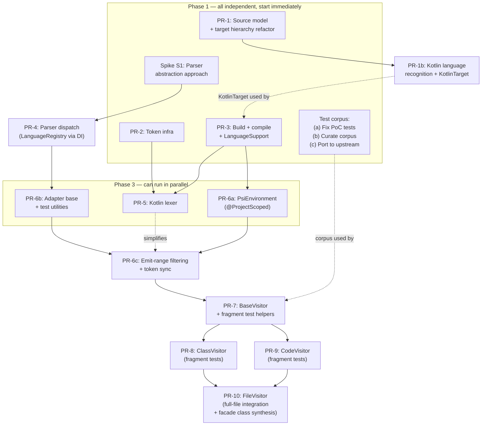

# Kotlin Upstreaming Plan

## Context

BlueJ's Kotlin support was prototyped in the `kotlin-cleanup` branch as a PoC using JetBrains' Kotlin compiler PSI (Program Structure Interface) to parse Kotlin source and translate the PSI tree into BlueJ's existing callback-based parser infrastructure. The PoC is functional but messy — ~50 failing tests, static caches, dead code paths, duplicated logic.

Rather than trying to upstream the PoC branch directly, we are writing clean PRs piece by piece, targeting the `kotlin-support` branch (which already has DI and threadchecker improvements merged).

This document supersedes the original `whats-left.md` in the project root.

## Principles

1. **Clean PRs over PoC porting** — each PR is reviewable in isolation, compiles, and passes all existing tests. The PoC (`kotlin-cleanup`) is a reference, not a source of copy-paste.
2. **DI-first** — new components use `@ProjectScoped` DI instead of static singletons. Follow the `View` -> `ViewFactory` migration pattern already on `kotlin-support`.
3. **Composition over extraction** — don't refactor `JavaParser` internals. Compose new Kotlin infrastructure alongside it, dispatched via DI-managed registries.
4. **LanguageSupport as extension point** — introduce a `LanguageSupport` interface early as a skeleton, let its shape emerge organically as PRs land.
5. **Proposed designs validated during implementation** — the visitor hierarchy and other architectural choices are working hypotheses to be refined, not dogma.

## Target branch

All PRs target `kotlin-support` (or the tip of the merged chain). Each PR must:
- Compile cleanly
- Pass all existing Java tests
- Not break any existing BlueJ functionality

## Dependency graph



### Parallelism summary

| Phase | What can run in parallel | Prerequisites |
|-------|--------------------------|---------------|
| **Phase 1** | PR-1, PR-2, PR-3, Spike S1, Test corpus (a/b/c) | None (all independent) |
| **Phase 1.5** | PR-1b | PR-1 |
| **Phase 2** | PR-4 | Spike S1 |
| **Phase 3** | PR-5, PR-6a, PR-6b | PR-5 needs PR-2+3; PR-6a needs PR-3; PR-6b needs PR-4 |
| **Phase 4** | PR-6c | Needs PR-6a+6b; benefits from PR-5 |
| **Phase 5** | PR-7 | Needs PR-6c; uses corpus from Phase 1 |
| **Phase 6** | PR-8, PR-9 | Both need PR-7 only |
| **Phase 7** | PR-10 | Needs PR-8 + PR-9 |

## Status

| PR | Track | Status | Branch |
|----|-------|--------|--------|
| PR-1: Source model + target hierarchy | A | In progress | `common-source-representation` |
| PR-1b: Kotlin language recognition | A | Pending (needs PR-1) | — |
| PR-2: Token infrastructure | A | Pending | — |
| Test corpus: fix, curate, port | A | Pending | — |
| PR-3: Kotlin build + compile | B | Pending | — |
| S1: Parser abstraction spike | C | Pending | — |
| PR-4: Parser dispatch | C | Pending | — |
| PR-5: Kotlin lexer | D | Pending | — |
| PR-6a: PsiEnvironment | E | Pending | — |
| PR-6b: Callback adapter base | E | Pending | — |
| PR-6c: Emit-range filtering | E | Pending | — |
| PR-7: BaseVisitor + test infra | F | Pending | — |
| PR-8: ClassVisitor | F | Pending | — |
| PR-9: CodeVisitor | F | Pending | — |
| PR-10: FileVisitor | F | Pending | — |

## Key design decisions

### Target class hierarchy

The target class hierarchy is refactored to support multiple compilable languages without growing `ClassTarget` into a multi-language god class. Informed by Neil Brown's `target-classes` branch on `main` (see reference material).

```
Target → DependentTarget → CompilableTarget → ClassTarget (Java/Stride)
                                             → KotlinTarget
```

- **`CompilableTarget`** (extracted from `ClassTarget`): abstract base for any compilable target. Holds shared compilation infrastructure: queued state, compilation validity, diagnostic display, schedule compilation, editor properties. Declares abstract methods: `analyseSource()`, `hasSourceCode()`, `reload()`, `reInitBreakpoints()`, `markCompiling()`.
- **`ClassTarget`** extends `CompilableTarget`: handles Java and Stride source files. All existing Java/Stride-specific behavior stays here (Stride-to-Java conversion, frame editor, etc.).
- **`KotlinTarget`** extends `CompilableTarget`: handles `.kt` files. Has its own `getSourceFile()`, `analyseSource()`, `getEditor()`, etc. Introduced in PR-1b as a stub; implementations filled in by later PRs (PR-3 for compilation, PR-7+ for parsing).
- **`Package.getTargets(Class<T>)`**: generic replacement for `getClassTargets()`. Callers that need "anything compilable" use `CompilableTarget.class`; callers needing Java/Stride-specific behavior use `ClassTarget.class`.

This means language-specific behavior lives on the target subclass (polymorphism), while `LanguageSupport` / `LanguageRegistry` serve cross-cutting concerns that operate on generic `CompilableTarget` or `SourceFile` instances.

### DI integration

The `kotlin-support` branch provides `@ProjectScoped` DI via Guice. Key integration points:

| Component | PoC pattern | DI pattern |
|-----------|-------------|------------|
| PsiEnvironment | Static `getInstance()` | `@ProjectScoped` (like `ViewFactory`) |
| Parser selection | Hardcoded `JavaParser` | Implicit in target type (`ClassTarget` uses `JavaParser`, `KotlinTarget` uses PSI visitors) with `LanguageRegistry` for cross-cutting lookups |
| Callback adapters | Manual construction | `@ProjectScoped` with `@Inject` deps |
| Visitor creation | `new FileVisitor(callbacks)` | `@ProjectScoped KotlinVisitorFactory` |

### Parser abstraction — composition, not extraction

`JavaParser` stays as-is. The primary language dispatch is through the target class hierarchy: `ClassTarget` uses `JavaParser`, `KotlinTarget` uses the PSI visitor pipeline. A `@ProjectScoped LanguageRegistry` is available for code paths that receive a generic `CompilableTarget` or `SourceFile` and need language-dependent behavior (autocompletion, highlighting, editor features). This avoids invasive refactoring of the 3467-line `JavaParser` and means the Java path has zero regression risk.

### Token mapping unification

The PoC has three redundant mapping mechanisms:
- `KotlinKeywords` — string-based, for BlueJ's `JavaLexer`
- `TokenTypeMapper` — `IElementType`-based, using reference equality
- `BaseVisitor.guessTokenType` — debug-name-based, fragile fallback

After the Kotlin lexer swap (PR-5), `TokenTypeMapper` with `IElementType` identity becomes the single source of truth. The other two are removed. Kotlin lexer tokens are the same `IElementType` singletons as PSI leaf node types.

### Visitor architecture (proposed, to validate)

Three visitors + a shared helper base, replacing the PoC's five:

| Visitor | Scope | Handles |
|---------|-------|---------|
| **BaseVisitor** | N/A (abstract) | Data extraction helpers, token creation, modifier mapping |
| **FileVisitor** | File level | Package, imports, top-level dispatch. Synthesizes `FooKt` facade class for top-level functions/properties. |
| **ClassVisitor** | Classifier body | Class header/body, constructors, init blocks, fields, nested classifiers, companion objects. |
| **CodeVisitor** | Executable code | Function signature + body, all statements/expressions, local variables, lambdas. Scope tracking (FILE_LEVEL / CLASS_LEVEL / BODY_LEVEL) replaces the PoC's separate FunctionVisitor + MethodBodyVisitor. |

Changes from the PoC:
- `FunctionVisitor` + `MethodBodyVisitor` merge into `CodeVisitor` (FunctionVisitor had zero unique callbacks, dead `topLevelFunction` flag)
- `CodeVisitor` carries a scope enum instead of using separate classes
- `FileVisitor` synthesizes facade class for top-level functions (the PoC attempted but abandoned this)
- Parameter-processing code is deduplicated (was written 3 times in PoC)

### LanguageSupport interface

Introduced as a skeleton in PR-3, methods added organically. With the target class hierarchy, `LanguageSupport` is **not** the primary dispatch mechanism — that's the target type itself (`ClassTarget` vs `KotlinTarget`). Instead, `LanguageSupport` serves **cross-cutting concerns** where code operates on a generic `CompilableTarget` or `SourceFile` and needs language-specific behavior:

```java
public interface LanguageSupport {
    // Added by PR-3:
    Compiler getCompiler();
    // Added by PR-5:
    TokenStream createLexer(SourceFile source);
    // Future: completionProviderFor(), highlighterFor(), etc.
}
```

A `@ProjectScoped LanguageRegistry` maps `SourceType` -> `LanguageSupport`. It is used by components that are not target-type-aware (e.g., editor infrastructure, autocompletion framework) but need language-specific implementations. Target subclasses may also use it internally to obtain their language support rather than hardcoding dependencies.

## Tracks

| Track | Focus | PRs | Details |
|-------|-------|-----|---------|
| [A: Foundation](tracks/a-foundation/README.md) | Source model + target hierarchy + token infrastructure + test corpus | PR-1, PR-1b, PR-2, test corpus | Unified `SourceFile` abstraction, `CompilableTarget` extraction, `KotlinTarget`, language-agnostic token queries, Kotlin test corpus |
| [B: Build & Compile](tracks/b-build-compile/README.md) | Kotlin compilation + workbench | PR-3 | `KotlinCompiler`, `LanguageSupport` skeleton, file templates |
| [C: Parser Dispatch](tracks/c-parser-dispatch/README.md) | Parser abstraction + DI dispatch | S1, PR-4 | `LanguageRegistry`, composition over extraction |
| [D: Lexer](tracks/d-lexer/README.md) | Kotlin lexer + token mapping | PR-5 | Swap to Kotlin's lexer, unify `TokenTypeMapper` |
| [E: PSI Infrastructure](tracks/e-psi-infrastructure/README.md) | PSI environment + callback adapters | PR-6a, 6b, 6c | `PsiEnvironment`, MethodHandle adapters, emit-range filtering |
| [F: Visitors](tracks/f-visitors/README.md) | PSI visitor hierarchy | PR-7, 8, 9, 10 | BaseVisitor, ClassVisitor, CodeVisitor, FileVisitor |

## Reference material

- **PoC branch**: `kotlin-cleanup` worktree at `repos/BlueJ-Greenfoot/kotlin-cleanup/`
- **Upstream Kotlin prototype** (Neil/Vitalij): `upstream/kotlin` branch — different approach (token-based), useful for workbench/compilation code
- **Target hierarchy refactor** (Neil): [`target-classes` branch on `main`](https://github.com/k-pet-group/BlueJ-Greenfoot/compare/main...neilccbrown:BlueJ-Greenfoot:target-classes) — introduces `CompilableTarget` and `KotlinTarget`. Based on `main`, not `kotlin-support`; we redo this on `kotlin-support` informed by the approach.
- **Original notes**: `whats-left.md` in project root (superseded by this plan)
- **DI infrastructure**: `kotlin-support` branch — `BlueJInjector`, `ProjectScope`, `ViewFactory`
- **Key source locations**:
  - Parser: `bluej/src/main/java/bluej/parser/`
  - Lexer: `bluej/src/main/java/bluej/parser/lexer/`
  - AST nodes: `bluej/src/main/java/bluej/parser/nodes/`
  - PoC visitors: `bluej/src/main/java/bluej/parser/psi/visitor/` (in `kotlin-cleanup`)
  - PoC adapters: `bluej/src/main/java/bluej/parser/psi/` (in `kotlin-cleanup`)
