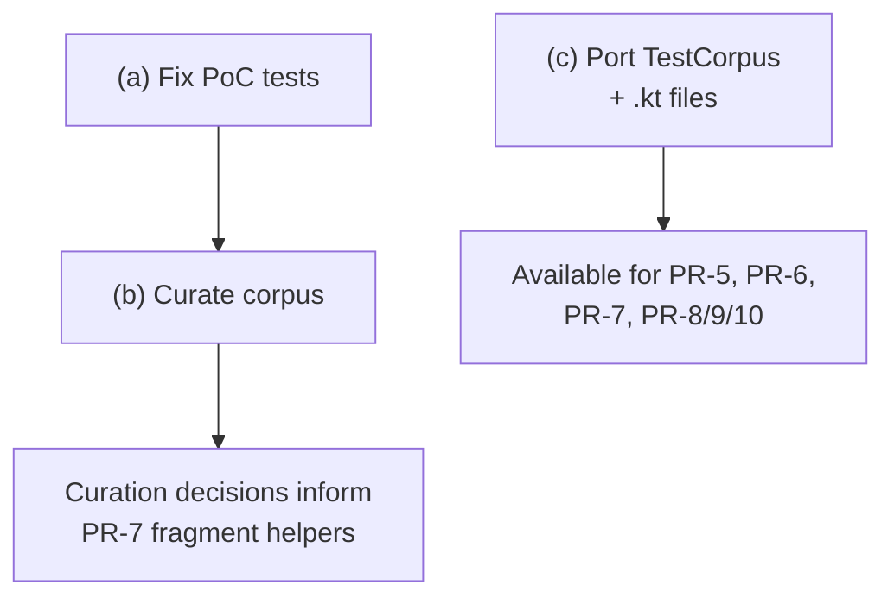

# Test Corpus: Fix, Curate, and Port

## Goal

Prepare the Kotlin test corpus for use by all subsequent PRs. This breaks into three sub-tasks that can proceed independently in Phase 1.

## Sub-tasks

### (a) Fix PoC tests (~50 failing)

**Where**: `kotlin-cleanup` worktree (NOT the upstream branch)

**What**: The PoC has ~50 failing tests. Fix them to validate that the test expectations are actually correct before we port anything. No point porting broken tests.

**Scope**: This is work in the PoC directly — fixing test expectations, updating test data, resolving test infrastructure issues. It does NOT mean making the PoC clean; it means making the tests trustworthy as a reference.

**Independent**: Can start immediately, no prerequisites.

### (b) Curate the corpus

**Where**: Analysis task — produces decisions, not code

**What**: Review the 76 `.kt` test resource files (15 simple, 21 moderate, 22 complex, 8 edge-cases) and decide:
- Which files to keep, drop, or modify
- How to organize for fragment-based testing (do we need new fragments? can existing files serve double duty as both full-file and fragment tests?)
- Which files cover which Kotlin constructs (make this mapping explicit)
- Are there gaps in coverage? (e.g., no test file for `when` as expression vs statement, no test for destructuring in lambdas)
- Which files from `simple/` serve as the smoke tests for PR-8/PR-9 fragment testing

**Informed by**: Results from (a) — once we know which tests are correct, we know which corpus files produce trustworthy expected output.

**Deliverable**: A short curation doc (can live alongside this README) listing keep/drop/modify decisions and construct coverage mapping.

### (c) Port test loading infrastructure

**Where**: `kotlin-support` branch

**What**: Port `TestCorpus.java` and the corpus `.kt` files. This can land as its own tiny PR or bundled with PR-3.

`TestCorpus.java` is **pure Java standard library** — zero BlueJ or Kotlin dependencies. It discovers and loads `.kt` files from the classpath using `java.nio.file` and classloader resources. The corpus `.kt` files are just data files.

**Contents**:
- `TestCorpus.java` (~307 lines) → `bluej/src/test/java/bluej/parser/psi/TestCorpus.java`
- 76 `.kt` files → `bluej/src/test/resources/bluej/parser/psi/test-corpus/` (organized into `simple/`, `moderate/`, `complex/`, `edge-cases/`)
- 4 token position test files → `bluej/src/test/resources/bluej/parser/psi/tokens/`

**Independent**: Can start immediately. No PSI, visitor, or Kotlin compiler dependencies.

## What this does NOT include

- **Fragment-based test helpers** (`parseClassBody(...)`, etc.) — these depend on PSI infrastructure and live in PR-7
- **`CallbackRecorder`, `PairingValidator`, `ForwardingCallbackRecorder`** — these depend on `JavaParserCallbacks` and live in PR-6b
- **`BasePsiTest`** — deeply coupled to PSI infrastructure (`PsiEnvironment`, `FileVisitor`, `KtFile`), lives in PR-7

## Relationship to other PRs

## Acceptance criteria

- [ ] (a): PoC test suite has zero unexpected failures (known limitations documented)
- [ ] (b): Curation doc exists with keep/drop/modify decisions and construct coverage
- [ ] (c): `TestCorpus.java` compiles on `kotlin-support` with no PSI dependencies
- [ ] (c): All corpus `.kt` files are loadable via `TestCorpus.getTestFiles()`
- [ ] (c): A simple test verifies corpus discovery works (file count, categories)

## Estimated effort

- **(a)**: Medium — depends on what's actually broken; could be quick fixes or deeper issues
- **(b)**: Small — 1-2 hours of review and documentation
- **(c)**: Small — mostly file copying + verifying the classloader-based discovery works
