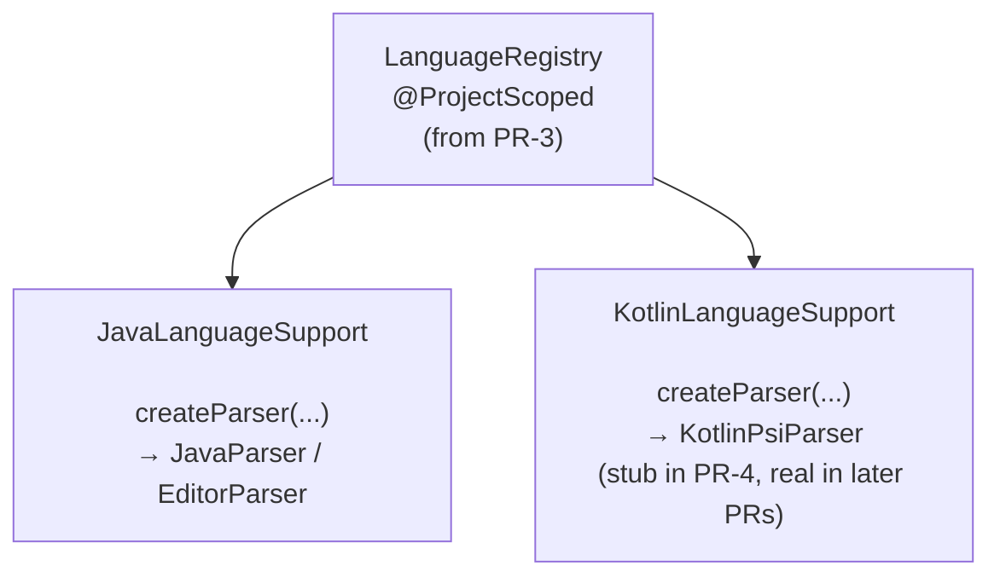

# Track C: Parser Dispatch

## Goal

Make BlueJ's parser infrastructure pluggable so it can dispatch to different parsers based on source language.

## PRs

| PR | Summary | Status |
|----|---------|--------|
| [S1: Parser Abstraction Spike](tasks/s1-parser-abstraction-spike/README.md) | Determine the best approach for multi-language parser support | Pending |
| [PR-4: Parser Dispatch](tasks/01-parser-dispatch/README.md) | Implement the dispatch mechanism (expected: composition via `LanguageRegistry`) | Pending |

## Dependencies

- **S1** has no prerequisites — can start immediately (Phase 1)
- **PR-4** depends on S1 results and builds on `LanguageRegistry` from PR-3 (Track B)

Other tracks depend on this track's output:
- **PR-6b** (Track E: Callback adapter base) needs PR-4's parser dispatch mechanism

## Key decision: Composition over extraction

The central architectural decision for this track:

**`JavaParser` stays untouched.** A DI-managed `LanguageRegistry` dispatches to the right parser based on `SourceType`. This avoids invasive refactoring of the 3467-line `JavaParser`.

Why not extract a `ParserBehaviour` interface (as the PoC did)?
- `JavaParser` has 18 entry points — extracting an interface is a large, risky refactoring
- `EditorParser` extends `JavaParser` via inheritance, creating tight coupling
- The Java parsing path works correctly today — any refactoring risks regressions
- Composition lets the Kotlin path use a completely separate implementation without touching Java code

The spike (S1) exists to validate this decision and explore the exact mechanics.

## Architecture sketch

Callers that currently create `JavaParser` directly are updated to go through `LanguageRegistry`. `JavaParser` itself is NOT modified.
