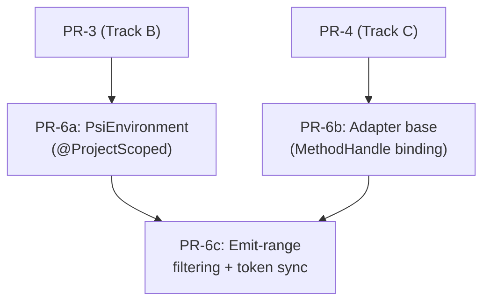

# Track E: PSI Infrastructure

## Goal

Establish the bridge between Kotlin's PSI tree and BlueJ's callback-based parser infrastructure. This track introduces the environment for creating PSI trees, the MethodHandle-based callback adapter layer, and the emit-range filtering that enables incremental parsing.

## PRs

| PR | Summary | Status |
|----|---------|--------|
| [PR-6a: PsiEnvironment](tasks/01-psi-environment/README.md) | `@ProjectScoped` wrapper for Kotlin PSI tree creation | Pending |
| [PR-6b: Callback Adapter Base](tasks/02-callback-adapter/README.md) | MethodHandle-based adapter bridging PSI visitors to BlueJ callbacks | Pending |
| [PR-6c: Emit-Range Filtering](tasks/03-emit-range-filtering/README.md) | Emit-range filtering + token stream synchronization for incremental parsing | Pending |

## This is the most complex track

The callback adapter layer alone is ~4000 lines in the PoC, with ~120 boilerplate method overrides in each of two classes (`JavaParserCallbacksAdapterImpl` at ~1927 lines, `KotlinParserCallbacksAdapterImpl` at ~2022 lines). The PSI infrastructure is the mechanical core that all visitor PRs (Track F) build on.

## Dependencies

- **PR-6a** needs PR-3 (kotlin-compiler-embeddable dependency)
- **PR-6b** needs PR-4 (parser abstraction — defines the callback interface shape)
- **PR-6a and PR-6b can run in parallel** (they depend on different upstream tracks)
- **PR-6c** needs both PR-6a and PR-6b; benefits from PR-5 (Track D: Kotlin lexer — `IElementType`-based token matching simplifies synchronization)

## DI integration

| Component | PoC pattern | Upstream pattern |
|-----------|-------------|------------------|
| `PsiEnvironment` | Static `getInstance()` singleton | `@ProjectScoped` with `@Inject` constructor |
| Callback adapters | Manual construction, passed around | `@ProjectScoped` with `@Inject` dependencies |

`PsiEnvironment` follows the same migration pattern as `ViewFactory` on the `kotlin-support` branch: replace a static singleton with a DI-managed `@ProjectScoped` instance. Each project gets its own `PsiEnvironment`, its lifecycle is managed by DI, and it's testable via scope injection.

## Key constraint: MethodHandle-based callback invocation

The adapters use `MethodHandles.privateLookupIn` + `bindTo` to pre-bind ~120 callback methods on `SourceParser` at construction time. This is a **deliberate design choice** that must be preserved:

- **Why not direct method calls?** BlueJ's `JavaParserCallbacksBase` methods are package-private/protected. The PSI visitor runs on a different thread, and direct calls would trigger the threadchecker (which enforces annotation-based thread constraints).
- **Why not reflection?** `Method.invoke()` has per-call overhead for access checks and boxing. With ~120 methods invoked thousands of times during parsing, this matters.
- **Why MethodHandles?** `MethodHandle.invokeExact()` has near-native call performance after JIT compilation. Pre-binding at construction time via `privateLookupIn` + `bindTo` means the runtime cost is a single virtual call — no access checks, no boxing, no threadchecker interception.

The pattern: at adapter construction, each callback method is looked up via `MethodHandles.privateLookupIn(targetClass, lookup).findVirtual(...)`, then bound to the target instance with `bindTo()`. At runtime, `mhCallback.invokeExact(args)` invokes the method directly.

## Shared context

The three PRs in this track form a layered stack:

1. **PR-6a (PsiEnvironment)** — the "input" side: takes Kotlin source text, produces a PSI tree
2. **PR-6b (Adapter base)** — the "output" side: takes callback invocations and routes them to BlueJ's parser infrastructure
3. **PR-6c (Emit-range filtering)** — the "filter" layer: wraps the adapter to only fire callbacks within a specified range, enabling incremental re-parsing

Track F (Visitors) then provides the "traversal" layer that walks the PSI tree and invokes callbacks through the adapter.
