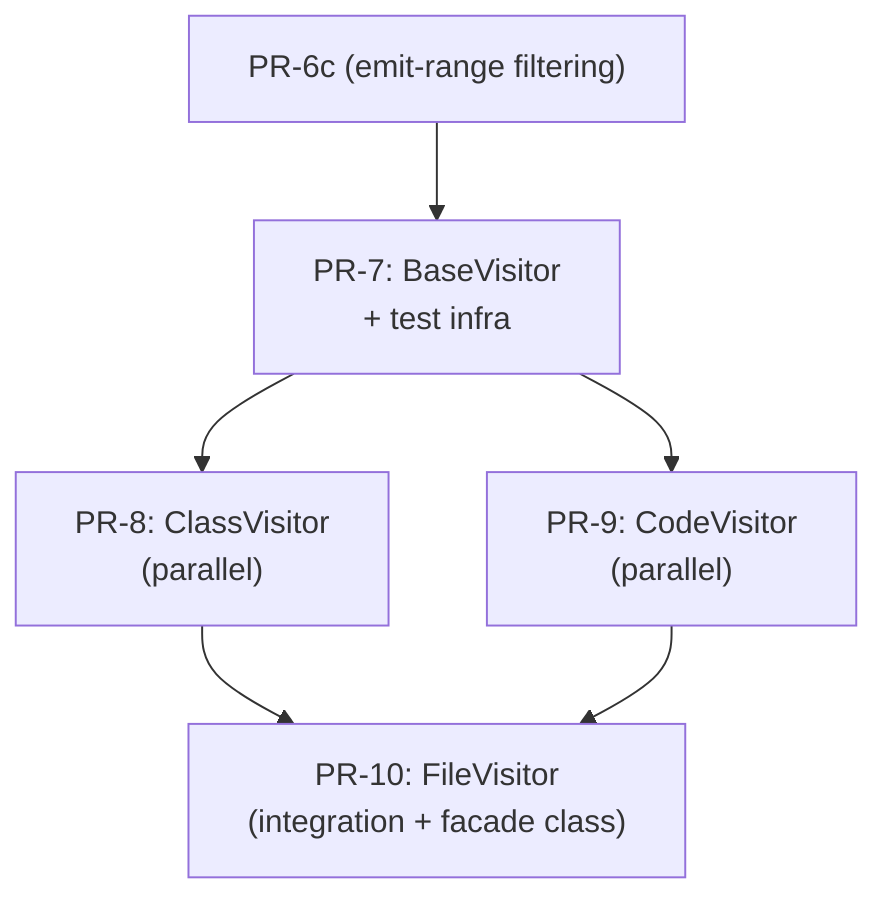

# Track F: Visitors

## Goal

Implement the PSI visitor hierarchy that translates Kotlin PSI trees into BlueJ's callback protocol. After this track, BlueJ can fully parse `.kt` files — recognizing classes, functions, statements, and expressions — and feed the results into its existing incremental parsing infrastructure.

## PRs in this track

| PR | Focus | Status | Branch |
|----|-------|--------|--------|
| [PR-7: BaseVisitor + Test Infrastructure](tasks/01-base-visitor/README.md) | Core visitor helpers, test corpus, fragment-based test helpers | Pending | -- |
| [PR-8: ClassVisitor](tasks/02-class-visitor/README.md) | Classifier body declarations | Pending | -- |
| [PR-9: CodeVisitor](tasks/03-code-visitor/README.md) | Function declarations, method bodies, statements, expressions | Pending | -- |
| [PR-10: FileVisitor](tasks/04-file-visitor/README.md) | File-level dispatch, facade class synthesis, full-file integration | Pending | -- |

## Dependencies

PR-7 depends on **PR-6c** (Track E: emit-range filtering) — the visitors need the callback adapter and token synchronization infrastructure that PR-6c provides.

PR-8 and PR-9 both depend on **PR-7 only** and **can run in parallel** with each other. They are tested with program **fragments** (class bodies, method bodies) — they do not need FileVisitor.

PR-10 depends on **PR-8 + PR-9** — it is the integration layer that dispatches to ClassVisitor and CodeVisitor. It is tested with **full-file** corpus tests.

## Proposed architecture

Three visitors with scope tracking, down from the PoC's five. This is a **working hypothesis** — implementation may reveal that the split needs adjusting.

| Visitor | Scope | Handles |
|---------|-------|---------|
| **BaseVisitor** | N/A (abstract) | Data extraction helpers, token creation, modifier mapping. No callbacks (except `error()`). |
| **FileVisitor** | File level | CU lifecycle, facade class synthesis for top-level functions, dispatch to ClassVisitor/CodeVisitor. |
| **ClassVisitor** | Classifier body | Class header, constructors, init blocks, fields, companion objects, nested classifiers. |
| **CodeVisitor** | Executable code | Function signatures, method bodies, all statements/expressions, local variables, lambdas. Scope tracking (FILE_LEVEL / CLASS_LEVEL / BODY_LEVEL). |

### Changes from the PoC

- `FunctionVisitor` + `MethodBodyVisitor` merge into `CodeVisitor` — FunctionVisitor had zero unique callbacks and a dead `topLevelFunction` flag.
- `CodeVisitor` carries a scope enum instead of using separate visitor classes for context awareness.
- `FileVisitor` synthesizes `FooKt` facade class for top-level functions — the PoC attempted this (BaseVisitor lines 349-356) but abandoned it.
- Parameter-processing callback loop deduplicated — was written 3 times in the PoC (FunctionVisitor, ClassVisitor primary ctor, ClassVisitor secondary ctor).

## DI integration

A `@ProjectScoped KotlinVisitorFactory` centralizes visitor creation and dependency wiring. It receives `PsiEnvironment`, the callback adapter, and other dependencies via `@Inject`, then creates visitor instances on demand. Visitors themselves are per-parse-invocation (not DI-managed directly) — they carry mutable state (current position, scope) that is not safe to share.

## Important note on BaseVisitor

BaseVisitor should be implemented **critically**, not by blindly copying the PoC. The PoC's BaseVisitor grew organically during prototyping and has accumulated cruft. A common base class is necessary, but its shape should be driven by what the clean visitor implementations actually need, not by what the PoC happened to put there.

## Test strategy

Test infrastructure is split across PRs based on when each piece is first needed:

| Infrastructure | Home PR | Why there |
|---|---|---|
| `CallbackRecorder`, `PairingValidator`, `ForwardingCallbackRecorder` | PR-6b (Track E) | They implement/extend `JavaParserCallbacks`, the interface PR-6b introduces |
| `TestCorpus`, corpus `.kt` files (76 files from PoC) | PR-7 | First PR that needs actual Kotlin parsing in tests |
| Fragment-based test helpers (`parseClassBody(...)`, `parseMethodBody(...)`) | PR-7 | Wraps code in synthetic file, navigates PSI to relevant subtree |
| Fragment-based visitor tests | PR-8, PR-9 | ClassVisitor/CodeVisitor tested in isolation with focused fragments |
| Full-file integration tests | PR-10 | FileVisitor ties everything together, validates the complete chain |

**Fragment-based testing** means the Kotlin PSI parser always produces a `KtFile`, but we wrap the fragment in a synthetic file/class, parse it, navigate the PSI tree to the relevant subtree, and run the visitor directly. E.g., to test ClassVisitor: parse `"class _Wrapper_ { <fragment> }"`, navigate to `KtClass`, and call `classVisitor.visitClass(ktClass)`.

## Key question to resolve during implementation

**Facade class synthesis for top-level functions.** When a `.kt` file has top-level functions, the Kotlin compiler produces a `FooKt` facade class containing them as static methods. FileVisitor should synthesize callbacks that model this (e.g., `gotTypeDef` + `beginTypeBody` for a synthetic `FooKt` class, then dispatch the top-level functions as methods within it). The PoC abandoned this, but PR-1's multi-class `SourceInfo` now properly models multiple classes per file, making this feasible. The exact mechanism needs to be validated during PR-7 implementation.

## PoC reference

All visitors live under `repos/BlueJ-Greenfoot/kotlin-cleanup/bluej/src/main/java/bluej/parser/psi/visitor/`:

| File | Lines | Role |
|------|-------|------|
| `BaseVisitor.java` | ~1354 | Abstract base — data extraction, token creation, modifier mapping |
| `FileVisitor.java` | ~140 | File-level dispatch |
| `ClassVisitor.java` | ~930 | Classifier body |
| `FunctionVisitor.java` | ~220 | Function signature (merges into CodeVisitor) |
| `MethodBodyVisitor.java` | ~1121 | Method body, statements, expressions (merges into CodeVisitor) |
| `PsiVisitor.java` | ~46 | Interface — token base, emit range |
